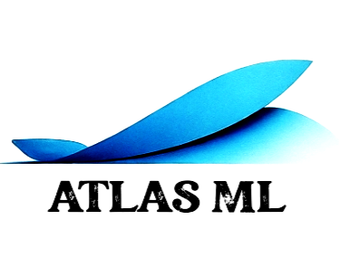

<p align="center">
  
</p>


# Atlas ML

Welcome to Atlas ML, a comprehensive resource for machine learning algorithms. This repository is designed to serve as a practical toolkit for seasoned data scientists and researchers.

## Overview

ML Toolkit implements the most famous machine learning algorithms, ranging from traditional techniques like linear regression and decision trees to advanced deep learning models such as convolutional neural networks and ViT.

## Features

- **Wide Range of Algorithms**: Covers various domains of machine learning, including supervised learning, self-supervised, and unsupervised learning (reinforcement learning?)
- **Detailed Documentation**: Each algorithm comes with its own README, outlining the theory behind the algorithm, its applications, and key considerations.
- **Example Datasets**: Includes sample datasets for testing and learning, demonstrating how each algorithm can be applied in real-world scenarios.
- **Extensible Code**: Designed to be modular and easy to extend, encouraging further development and adaptation to specific needs.

## Getting Started

To get started with ML Toolkit, clone this repository and install the required dependencies as listed in the requirements.txt file:

```
git clone https://github.com/yourusername/atlas-ml.git
cd atlas-ml
pip install -r requirements.txt
```

You can then navigate to the directory of an algorithm and run the corresponding script to see it in action.

## Contribution

Contributions are welcome! If you would like to add a new algorithm, improve an existing implementation, or suggest a feature, please fork the repository and submit a pull request.

## Contact

If you have any questions or feedback, please open an issue in the repository, and we will get back to you as soon as possible.
